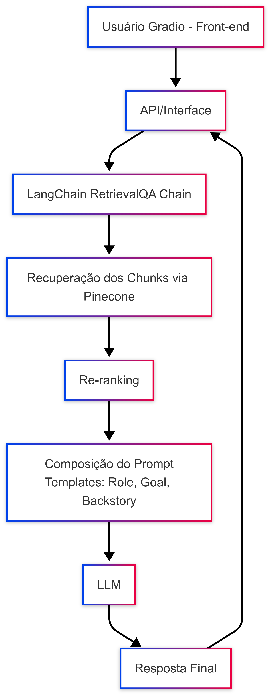

# Advanced RAG Chatbot

This project is an implementation of a **Generative AI system with Retrieval-Augmented Generation (RAG)**, designed to answer questions about the book *On the Origin of Species* by Charles Darwin. The system integrates multiple stages – from ingestion and preprocessing of the text, embedding generation, vector store indexing (Pinecone), retrieval and re-ranking of relevant chunks, to prompt composition and final response generation via an LLM. Additionally, the system includes a caching mechanism and a clarification step to handle ambiguous questions.



## Case Requirements

* **Language:** Python
* **Framework:** Integration of generative models via LangChain (including ChatOpenAI for chat models)
* **Architecture:**

  * *Data ingestion and preprocessing*
  * *Embedding generation and indexing in Pinecone*
  * *Retrieval with re-ranking*
  * *Prompt composition* (using **role**, **goal**, **backstory**, and **question**)
  * *Final response generation*
* **Differentiators:**

  * Implementation of re-ranking to enhance document relevance
  * Clarification mechanism for ambiguous questions
  * Cache system for optimizing repeated queries
* **Demo:** Demonstration video

## Installation

1. **Clone the repository:**

   ```bash
   git clone https://github.com/joaojulio/advanced_rag.git
   cd advanced_rag
   ```
2. **Create and activate a virtual environment (using Anaconda or virtualenv):**

   ```bash
   conda create --name advanced_rag python=3.9
   conda activate advanced_rag
   ```
3. **Install dependencies:**

   ```bash
   cd rag_solution
   pip install -r requirements.txt
   ```
   
  Note: Make sure all required dependencies (such as Pinecone, langchain-openai, langchain-community, Gradio, diskcache, etc.) are properly installed as specified in requirements.txt.
  
4. **Set environment variables:**
   Create a `.env` file at the root of the project with the following content (replace the keys as needed):

   ```bash
   OPENAI_API_KEY=your_openai_api_key
   PINECONE_API_KEY=your_pinecone_api_key
   PINECONE_ENV=your_pinecone_env  # e.g., "us-east-1"
   ```

## Execution

### Gradio Front-End

To start the chatbot interface, run:
\`\`\`bash
python src/front\_end/app.py
This will open the Gradio interface in your browser, where you can type your question about *On the Origin of Species* and receive a generated response from the system.

## Other Modules

* **Preprocessing and Indexing:**
* Run the data preparation script (`prepare_data.py`) to generate text chunks.
* Run the indexing script (`pinecone_indexer.py`) to generate embeddings and perform the upsert into Pinecone.
* **Testing:**
  To run the test suite, execute:

  ```bash
  pytest tests/
  ```

## Main Features

* **Ingestion and Preprocessing:**
  The book text is loaded, processed, and split into chunks to facilitate retrieval.

* **Embedding Generation and Indexing:**
  Each chunk is converted into an embedding vector using the OpenAI model and indexed in a vector database (Pinecone).

* **Retrieval with Re-Ranking:**
  Upon receiving a query, the system retrieves the most relevant chunks and reorders them using a cross-encoder model.

* **Prompt Composition and Response Generation:**
  A custom prompt template (combining role, goal, backstory, and question) is used to compose the final prompt sent to the LLM to generate the answer.

* **Cache Mechanism:**
  Responses are cached to optimize repeated queries.

* **Clarification Step:**
  If the user's question is ambiguous, the system uses an LLM to generate a clarifying question and asks for more detail before proceeding.

## Product Considerations and Evolution

* **Context and Memory Management:**
  Currently, the system does not implement multi-turn conversational memory, but this functionality is recommended for future versions.

* **Evolution to Agentic RAG:**
  The Advanced RAG establishes a robust foundation for contextualized responses. As a next step, Agentic RAG can be implemented to add a layer of “multi-step reasoning” or integration with external tools. For example:

  * Multi-Hop Retrieval: The agent could retrieve excerpts from Darwin’s book and then consult another knowledge base to compare with a different author.
  * Dynamic Clarification: It could ask follow-up questions to better define context (e.g., "Are you referring to the 1859 or 1872 edition?").
  * Task Orchestration: Advanced RAG serves as a base, while Agentic RAG introduces an additional level of interaction and reasoning for more complex tasks.

* **Interface and Usability:**
  The Gradio front-end demonstrates the system’s functionality. In the future, the interface could be enhanced to include conversation history, support for multi-turn dialogue, among other features.

* **Technical Recommendations:**

* Migrate to the new `ChatOpenAI` interface as recommended by LangChain.

* Consider implementing metadata for source reference (chapters, sections, etc.) to improve transparency in responses.

## Demonstration

A short video demonstrating how the system works, highlighting:

* User Interaction:
  How users input their questions in the Gradio interface.

* Clarification Step:
  If the question is ambiguous, the system requests additional details from the user.

* Full Flow:
  From data ingestion, retrieval with re-ranking, prompt composition to final response generation.

* Cache Usage:
  Demonstration of how repeated queries are optimized using the caching mechanism.

Watch the demo video on YouTube:
[](https://www.youtube.com/watch?v=AewMMIsGMLs)
